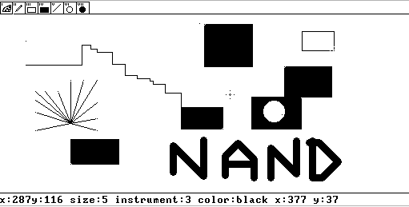

# Nand2Paint

Paint написанный на языке jack в рамках курса Nand2Tetris.

## Управление
#### Настройка инструментов
- **WASD** - движение курсора вверх вниз
- **YUHJ** - движение по горизантаоям
- **SPACE** - начать рисовать/ сохранить позицию начала для фигур
- **E** - Потвердить создание фигуры
- **ZX** - размер кисти
#### Инструменты
- **1** - сменить цвет
- **2** - инструмент кисть
- **3** - прямоугольник без заливки
- **4** - прямоугольник с заливкой
- **5** - прямая
- **6** - круг с белой заливкой
- **7** - круг с черной заливкой

## Как использовать
С помощью VMEmulator из папки tools откройте папку vm. Отключите анимации, поставте скорость рааботы на Fast. И запустите код, нажав кнопку run.

Также мы для удобства рисования, мы реализовали эмулятор мыши для нашего приложения на Python. Он позволяет управлять курсором с помощью передвижении мыши. На Q запускаеться преобразование движения мыши в эмитацию нажатий клавиш клавиатуры. На E отключаеться.