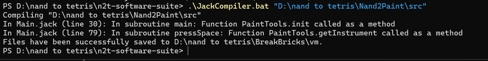

# Интерфейс и впечатления пользователя
## -вайбы:
1. при попытке скомпилить получалось такое 
    ps. илья быстро поправил
2. если экран черный, то не видно где курсор, тк он тоже черный 
## +вайбы

1. пэйнт офигенный
2. очень большой функционал - это восторг, а еще если вспомнить, что мы на джеке, то вообще ультра восторг, ребята, вы крутые
3. круто придумано с эмулятором мышки
4. подробная инструкция в readme
## +-вайбы
1. "YUHJ - движение по горизанталям" - написано в readme, но происходит движение по диагонали 
## какие-та приколы
1. когда рисуешь, оставляя линию, потом без рисования двигаешь курсор, отрисованная линия укорачивается (хотя возможно это приколы отрисовки, конкретно у меня) $\uparrow$ нарисовала
 $\uparrow$ сдвинула курсор

    мне кажется, что это даже не баг, а фича))))
    
    
# Структура и код
## -вайбы
### названия переменных
1. main.jack
    ```c#
    function int binPow(int a, int n){
        var int p;
        if (n = 0){
            return 1;
        }
        if (n / 2 * 2 * -1 + n = 1){
            let p = Main.binPow(a, n - 1)*a;
            return p;
        }
        else{
            let p = Main.binPow(a, n / 2);
            let p = p * p;
            return p;
        }
    }
    ```
    с первого взгляда не очень понятно чего за ```a```, ```b``` и ```p```, можно чуть-чуть по-информативнее
2. square.jack (в vector.jack тоже самое)
    ```c#
    let xx1 = Math.min(x1, x2);
                let xx2 = Math.max(x1, x2);
                let yy1 = Math.min(y1, y2);
                let yy2 = Math.max(y1, y2);
    ```
    тут тоже не очень понятно чего за ```xx``` и ```yy```
### Структура
1. DrawUI.jack
    ```c#
    function void init () {
            var int memAddress; 
            let NameOfX = "x:";
            ...
            let memAddress = 16384;
            // column 0
            do Memory.poke(memAddress, -1);
            do Memory.poke(memAddress +32, -32767);
            do Memory.poke(memAddress +64, -32763);
            do Memory.poke(memAddress +96, -32763);
            ...
    ```
    здесь хотелось бы вынести метод ```draw``` и вызывать, потому что не очень логично, что мы сначала инициализируем текстовые переменные, а потом делаем какие-то ```Memory.poke```. Не очень логично в инициализации рисовать 
## +вайбы
1. комментарии очень облегчают понимание, спасибо
2. все в своих методах и классах
3. структура - кайф 