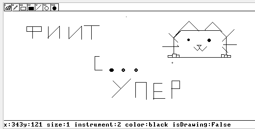
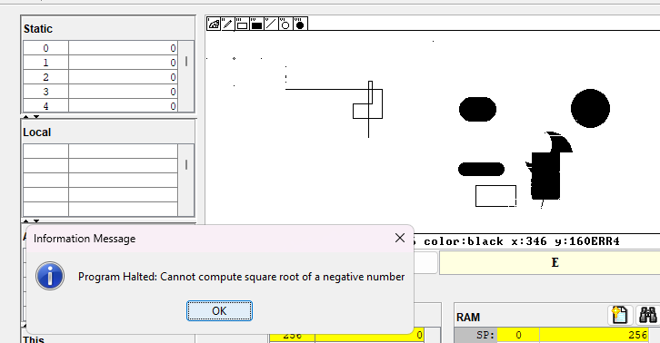
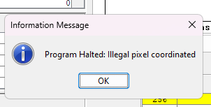
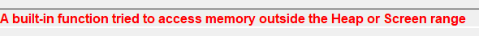
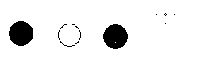
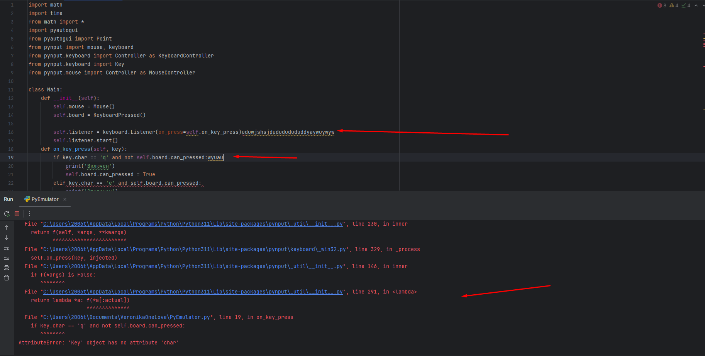
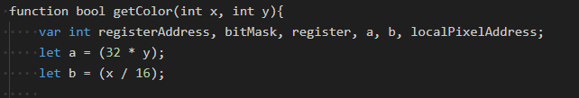
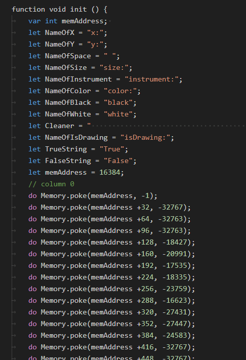
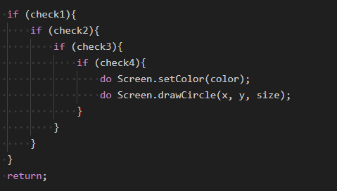

# Прикольчики:
- Очень оригинальная идея с реализацией paint'а
- Довольно большой функцианал, с учетом того, как много вспомогательных методов и проверок надо осуществлять
- Подробная инструкция к использованию и запуск в README
- Крутая идея с тем, чтобы сделать эмулятор для управления мышью, хоть он и требует доработки это показывает как вы заботитесь о бедном пользователе, который не хочет тыкать WASD, чтобы управлять курсором)
- Разбили все по классам, но есть пара моментов, когда хотелось бы выделить еще методы, чтобы не засорять функции не их функционалом
- Можно нарисовать кота, восторг

# Не очень прикольчики:
- Остается след от курсора при рисовании фигур
Из этого вытекает немного неприятная фигня, что курсор бывает очень тяжело заметить(понятно, что если попытаться сделать его заметнее, то это сломае все еще больше)

- Не учитывается цвет кисти при использовании круга с заливкой определенного цвета
- Вылет программы при попытке сделать большое расстояние между начальной и конечной точкой при рисовании круга

- когда курсор у границы и увеличивается размер кисти, выход за границу

- А это, когда курсор у нижней границы экрана увеличиваем

- возможно это очевидно, но мне кажется было бы неплохо где-то прописать, что от основного цвета зависит по сути то, будет у круга с определенной заливкой обводка противоположного цвета или нет, потому что видимо это именно так и работает

- Раз уж вы делаете эмелятор на python и предлагаете его для использования(насколько я поняла) было бы лучше сделать файл requirements.txt со всеми необходимыми зависимостями, а то так заходить, смотреть какие зависимости нужны, качать их, не очень удобно
- ээээм, тут какая-то вакханалия происходит, во-первых он как-то не всегда работает, во-вторых моментами вылетает с какой-то ошибкой, в-третьих без нажатия клавы начинают вводится всякие буквы(страшно, очень страшно), а еще он в принципе перестал работать и выпадает с этой ошибкой...

# Микро придирки:
- а что такое a и b?

- Немного не понятно, за что в Init отвечате все, что после 153 строки, не лучше ли было выделить функцию и под это, чтобы ее название как-то отражало суть, и при этом в самом ините не было огромного полотна

- А нельзя просто в одном if'е проверить, что все условия выполняются через &? Оно же срабатывает только тогда, когда все 4 проверки выполняются
