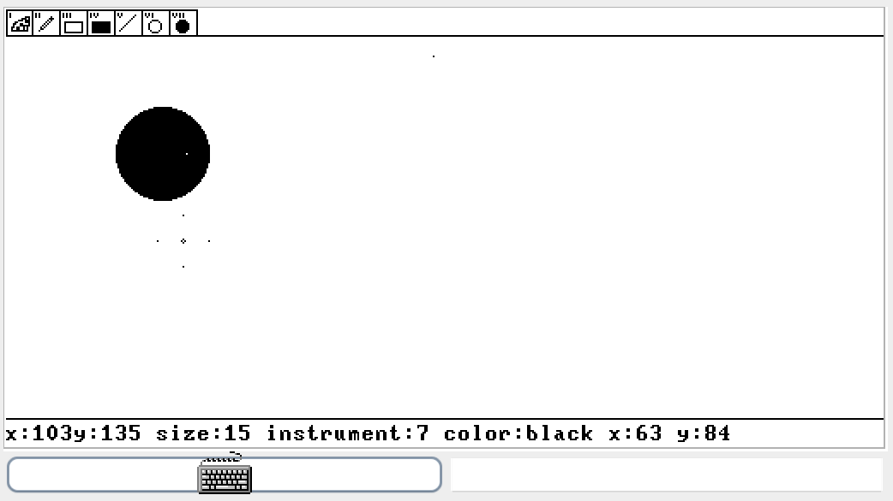
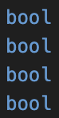
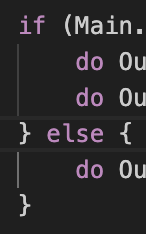
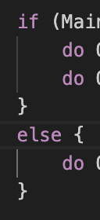
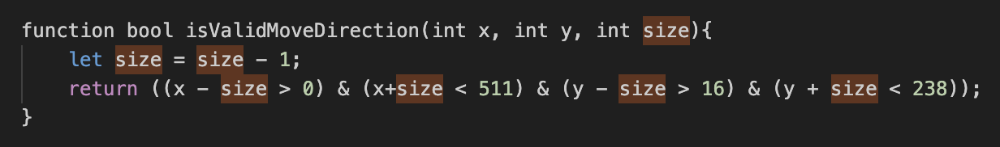
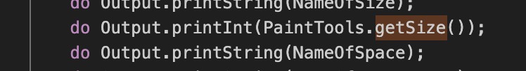
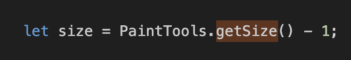
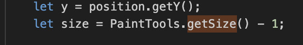

# РЕВЬЮ
## Комментарии по приложению
1. Было бы здорово добавить функцию очистки экрана - тогда не придётся стирать всё вручную / перезапускать, чтобы нарисовать что-то новое
2. Еще верхнюю панельку хотелось бы слегка увеличить, а то вообще не видно, что за инструменты, какие цифры...
3. Замечен небольшой баг? при рисовании фигур остаются незакрашенные пиксели там, где был "прицел", особенно заметно при большом размере кисти:

4. В остальном всё отлично
5. Хотела добавить красивый рисуночек, но ДКР по матану сама себя не напишет

## Комментарии по коду
### В целом:
1. Раз оно работает, то наверно все ок, но в Джеке же вроде **boolean**, а не bool...

2. Это скорее придирка и вкусовщина, но можно делать так , а не так 

### Класс Main:
1. Тики это прикольно (особенно нервные), но как-будто логичнее использовать **Sys.Wait()**
2. По-моему поля **cursor** и **isRelize** немного редундант (нигде не используются)
3. Есть ощущение, что лучше перенести функцию **binPow()** прямо в класс **Cursor**, так как тут она нигде не используется и создана только для функции **Cursor.getColor()**
4. В остальном прям смотреть приятно: хорошие комментарии и ровненькиий код

### Класс DrawUI:
1. Вижу кучу строк, но не вижу диспоузов или другого освобождения памяти. Но падения приложения так же не вижу, так что это скорее плюс. Присутствует огромная зависть

### Классы Circle, Line, Square, Pen:
1. Круто, что выделили отдельные классы под каждую фигуру
1. Круто придумали с проверкой через x=-1, y=-1 для первых трёх, чтобы не рисовалось, когда не надо
2. Не круто, что square это rectangle...

### Класс Сursor:
1. Метод **getColor()** - отдельно восхищаюсь, для меня эти всякие битовые маски - какая-то магия
2. Как-будто можно заинлайнить

...с другой стороны, так читаемее, так что может и не надо

### Класс PaintTools:
1. Есть вопрос к полю **size** и методу **getSize()**. Как я поняла, размер кисти, выводимый на экране, на 1 больше настоящего, и поле size соответствует как раз ему. Но это значение необходимо только в методе **DrawUI.PrintPosition()**,

а во всех остальных (**Cursor.savePixelUnderCursor, Cursor.isValidMoveDirection, DrawUI.loadPixelUnderCursor, DrawUI.drawCursor**) приходится вычитать единицу после вызова getSize(). 

  

Есть предложение добавить второй метод для получения "настоящего" размера кисти и использовать его в случаях, не касающихся отрисовки. Это не критично, но при чтении кода немного ставило в тупик, почему из size всегда вычиталась единица.
