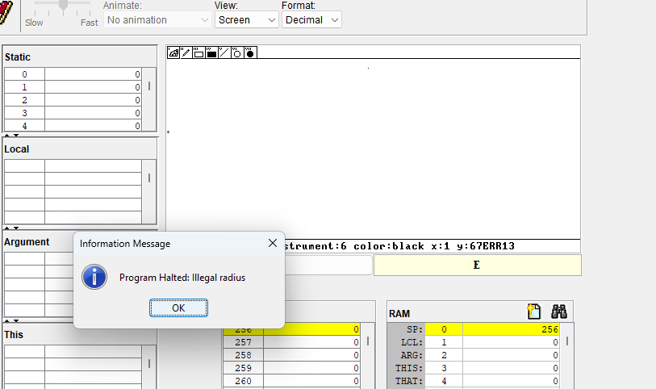

1) Circle.jack

var int x1, x2, y1, y2 - можешь быть лучше xStart, yStart, xEnd, yEnd

var int  midX, midY - может быть лучше не экономить на символах, а назвать middleX, middleY

2) PaintToos.jack

var Vector pos, prevPos; - аналогично, может лучше position и prevPosition?

3) Pen.jack

let check1 = Cursor.isValidMoveDirection(x, y);

let check2 = Cursor.isValidMoveDirection(x, y);

let check3 = Cursor.isValidMoveDirection(x, y);

let check4 = Cursor.isValidMoveDirection(x, y); - Зачем 4 раза подряд вызывать один и тот же метод?

4) Square.jack 

 xx1, yy1, xx2, yy2 - может тоже какие нибудь более подходящие названия использовать?

 5) DrawUI.jack
 
        // column 7
 		do Memory.poke(memAddress +487, -1);
		do Memory.poke(memAddress +7655, -1);
		// column 8
		do Memory.poke(memAddress +488, -1);
		do Memory.poke(memAddress +7656, -1);

            ....
            ....

		// column 31
		do Memory.poke(memAddress +511, -1);
		do Memory.poke(memAddress +7679, -1);  - может лучше сделать циклом?

5) Баги

При попытке нарисовать круг возле края экрана выводит ошибку : Illegal radius

В целом, проект очень интересный. Понятный интерфейс - легко и быстро освоить, наглядная и подробная инструкция по использованию, хорошо структурированный код

